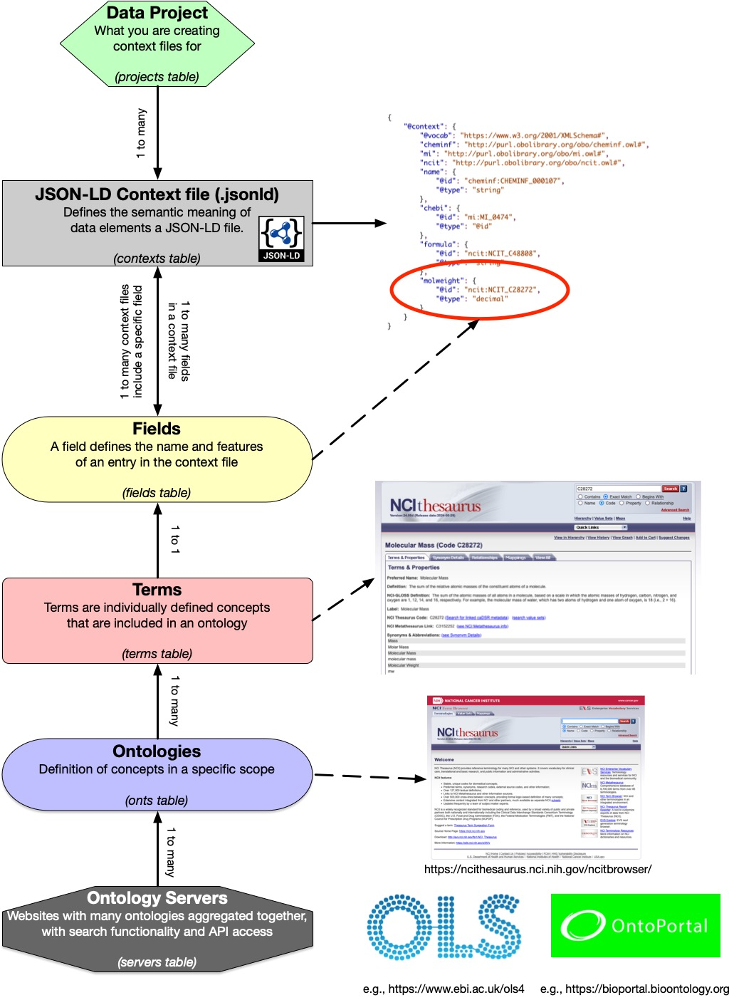

## SciContext: A JSON-LD Context File Authoring System
This project is a web-based authoring system, built in Django, to manage the creation and publishing of JSON-LD context 
files. As JSON-LD files [JSON-LD](https://json-ld.org/) are an encoding of the resource description framework ([RDF](https://www.w3.org/TR/rdf11-schema/)), context 
files are needed to provide the semantic annotation of (the meaning) data defined in a JSON-LD file, thus allowing them
to be converted into RDF [triples](https://en.wikipedia.org/wiki/Semantic_triple).

This application allows you to author JSON-LD context files and, once complete, and publishing them to the GitHub 
pages branch of your fork of the SciContext GitHub repository.  This means that once your context file is published
on GitHub (with GitHub pages enabled) your context files will be available at https://[username].github.io/SciContext/ctxs .

### How the system is set up
As there are many ontologies under development, finding concepts defined for your application can be time-consuming. 
Thankfully, there are now some centralized websites where ontologies are not only aggregated, but also indexed and 
searchable. SciContext takes advantage of these ontology 'lookup' servers as the source of the defined concepts 
in the ontologies they aggregate.

So, in SciContext you can find concepts and their definitions, create your own set of 'terms' from these ontology entries
and then use them to create a context file needed for a specific set of JSON-LD files.  In addition, if you have many
projects where you need to do this you can define those 'projects' in SciContext to organize your context files.

### Installing/Configuring SciContext
Installing and configuring SciContext requires a little bit of knowledge about GitHub.  The instructions below are for
users that want to author and then publish their context files via GitHub.  If you just want to play with the software 
(i.e. not publish any context files) you can create a local copy of this repo using the standard git URL 
(https://github.com/chalklab/SciContext.git), and then follow install instructions below on your forked repository.

1. **Fork this Repository**: To fork this repo login using your GitHub account, click the fork button top right and work 
   from your fork for the rest of these instructions.
2. **Copy the Forked Repo**: Pull down a copy of the repo using IDE's like PyCharm and VSCode, or GitHub Desktop so that your 
   local copy is linked to your forked repo.
3. **Create a GitHub Repository Secret**: In order to commit the context files to your GitHub fork SciContext needs an 
   authentication token to allow automating commits (in the background) to the repo.  To create the secret do the 
   following (more details are [here](https://docs.github.com/en/actions/security-for-github-actions/security-guides/using-secrets-in-github-actions)):
   - Click on 'settings' (above)
   - On the left click on 'Secrets and variables' and then on 'Actions'
   - Add a 'Repository secret' called 'SCTOKEN'. Copy and save the token in a safe and secure place once created!
   - In your local copy of the repository find the '.envtmp' file.  Rename the file to '.env' and copy the token into 
     that file so it is assigned to the variable 'SCTOKEN'.  The '.env' file is listed in the '.gitignore' file so it 
     will never be committed to GitHub (otherwise you will have to delete it and start again :( )
4. **Enable GitHub Pages**: In order to publish your context files (.jsonld) as a webpage (linking via the repo does not
   work) you need to enable GitHub pages.  This can be done easily by going to 'settings' above and clicking on 'pages' 
   in the left menu.  Underneah the button that syas 'Deploy from a branch' click the button that says 'None' and select
   branch 'main'. Then click 'Save'. That's it!  You will now have a website for the repo at https://[username].github.io/SciContext/ .
5. **Configure the Project**: In your local copy of the repo there are a few things to do so that SciContext can be run...

